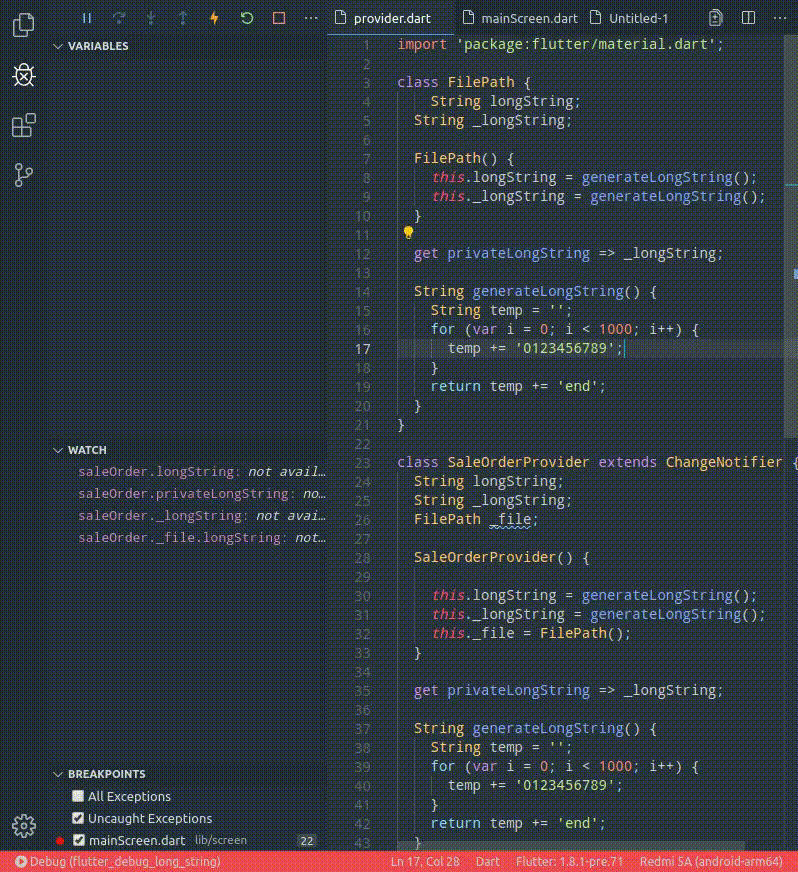

# Debug Long String

## Overview

This Flutter App is to help identifying problem, when one is copying private value
of class in **Debug Window**.

## Features

Features that are available in this app : 
- User have two classes that have longString and _longString property

## Demo

